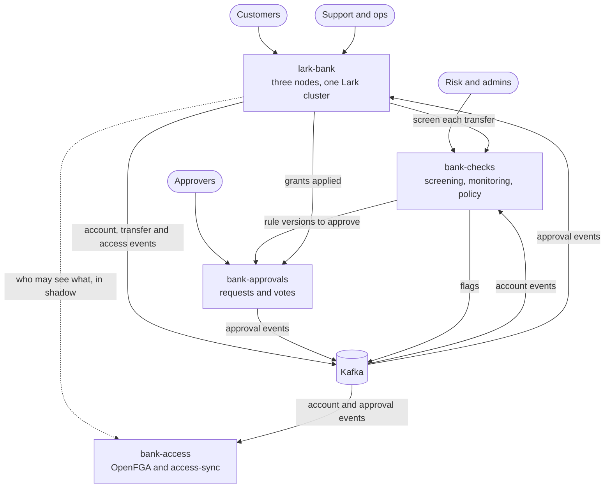

# tweet-street

A small bank, built to see whether a handful of Kotlin and Scala libraries hold up when the money has to add up. It
is four services: the bank itself on a three-node cluster, transfer screening, changes that need two people to
agree, and fine-grained access control. The name is Wall Street for birds, since it runs on
[Lark](https://github.com/matthewjones372/lark).

It is a personal project, not a real bank. It holds no real money, and the credentials in it are development values
for running it on your own machine.

## What it does

- **Every account is an actor** on a three-node [Lark](https://github.com/matthewjones372/lark) cluster. It owns its
  balance, writes its events to a Postgres journal before it answers, and lives on whichever node holds its shard.
- **A transfer is a saga.** It debits one account, credits the other, and refunds the first if the credit is
  refused. If the node running it dies part way through, another node picks it up from its last event.
- **The books are checked.** `GET /ledger` checks that the balances plus the money in flight equal everything paid in
  minus everything paid out.
- **It survives some chaos.** `scripts/chaos-docker.sh` cuts a node off, freezes another, stops a journal database
  and freezes Kafka, all under 200 transfers a second. Afterwards the ledger still balances, and every failed request
  was a 503 or a timeout that is safe to retry.
- **Each transfer is screened** by [bank-checks](bank-checks), against rules an admin writes in a web wizard in
  [verdict](https://github.com/matthewjones372/verdict)'s rule language.
- **Some changes need two people.** A new screening rule, or support looking at a customer's account, goes through
  [bank-approvals](bank-approvals), which keeps its audit trail as a hash chain. The customer can see each time
  support looked.
- **Access is decided in one place.** [bank-access](bank-access) holds an OpenFGA model, kept up to date from the
  other services' events.
- **Logs are checked for secrets.** The chaos run ends by searching every log line it caused for passwords, keys and
  anything shaped like a token, and fails if it finds one.



## How fast

Three bank nodes as containers on one 4-core, 16 GB machine, with Postgres committing durably, every event published
to Kafka, and the load generator on the same machine, measured with
[Proofload](https://github.com/matthewjones372/proofload):

| 60 seconds of | Failed | p50 | p99 |
|---|---|---|---|
| transfers at 400/s | 0 | 62 ms | 700 ms |
| transfers at 400/s, each one screened | 0 | 184 ms | 1.49 s |
| 600 payments a second into one account | 0 | 5 ms | 39 ms |

More runs, including what tracing costs, are in [lark-bank's README](lark-bank/README.md#what-it-carries).

## Where to start reading

| To see | Look at |
|---|---|
| The domain, with no framework in it | [`lark-bank/domain`](lark-bank/domain/src/main/kotlin/bank/domain): `Account.kt`, `Transfer.kt`, `Money.kt` |
| Accounts and transfers as actors on the cluster | [`Accounts.kt`](lark-bank/app/src/main/kotlin/bank/app/Accounts.kt), [`Transfers.kt`](lark-bank/app/src/main/kotlin/bank/app/Transfers.kt), [`ShardedBank.kt`](lark-bank/app/src/main/kotlin/bank/app/ShardedBank.kt) |
| The chaos run | [`lark-bank/scripts/chaos-docker.sh`](lark-bank/scripts/chaos-docker.sh) |
| Screening a transfer | [`bank-checks/screening`](bank-checks/screening/src/main/scala/checks/screening) |
| The audit trail as a hash chain | [`Chain.kt`](bank-approvals/domain/src/main/kotlin/bank/approvals/domain/Chain.kt) |
| How the four services fit together | [`lark-bank/docs/services.md`](lark-bank/docs/services.md) |
| Why each piece is the way it is | [`lark-bank/specs/`](lark-bank/specs), one spec per change |

## The folders

| Folder | What it is |
|---|---|
| [`lark-bank/`](lark-bank) | The bank. Accounts, payments and transfers as event-sourced actors on a three-node Lark cluster, journaled to Postgres and published to Kafka. Kotlin. It also holds the docker compose and kind setups that run all four services together. |
| [`bank-checks/`](bank-checks) | Screens each transfer before money moves and flags movements after, by rules an admin writes in a web wizard. Scala 3 and ZIO, with rules in [verdict](https://github.com/matthewjones372/verdict)'s language. |
| [`bank-approvals/`](bank-approvals) | Changes that more than one person agrees to before they take effect, with an audit trail kept as a hash chain. Kotlin on Lark and Pelican. |
| [`bank-access/`](bank-access) | Who may do what, in one place: an OpenFGA model, a service that derives relationships from events, and the client the other services ask. |

It is built on four libraries of mine: [Lark](https://github.com/matthewjones372/lark) for actors, clustering, event
sourcing and streams, [Pelican](https://github.com/matthewjones372/pelican) for HTTP endpoints and pages,
[Proofload](https://github.com/matthewjones372/proofload) for the load tests, and
[kimney](https://github.com/matthewjones372/kimney) for mapping between the wire and the domain.

## Running it locally

You need Docker and JDK 25. Each folder also has a Nix flake whose dev shell has everything else (`nix develop`).

The bank builds against snapshots of Lark and Pelican that are not on Maven Central yet, so clone them beside this
repository and tell Gradle where they are, once, in `~/.gradle/gradle.properties`:

```bash
git clone https://github.com/matthewjones372/lark ../lark
git clone https://github.com/matthewjones372/pelican ../pelican
cat >> ~/.gradle/gradle.properties <<PROPS
larkSource=$(cd ../lark && pwd)
pelicanSource=$(cd ../pelican && pwd)
accessSource=$(pwd)/bank-access
PROPS
```

With docker compose, three bank nodes, two Postgres databases and Kafka on one machine:

```bash
cd lark-bank
./gradlew :app:installDist :loadtest:installDist
docker build -f deploy/docker/bank.Dockerfile -t lark-bank:dev .
docker build -f deploy/docker/loadtest.Dockerfile -t lark-bank-loadtest:dev .
docker compose -f deploy/docker/compose.yml up -d --wait
docker compose -f deploy/docker/compose.yml run --rm -e SCENARIO=transfers load
```

The API and its docs are then at http://localhost:8080/api-docs, the customer pages at http://localhost:8080/ and
Grafana at http://localhost:3000. The compose profiles `checks`, `approvals`, `access`, `traces` and `logs` add the
other services and the observability stack; each needs its service's image built first (see that folder's README).

With [kind](https://kind.sigs.k8s.io), all four services on a local three-worker Kubernetes cluster:

```bash
cd lark-bank
scripts/up.sh       # builds every image from the folders beside it, makes the cluster, applies deploy/k8s
scripts/load.sh transfers
scripts/down.sh
```

`scripts/up.sh` uses Nix for bank-checks and bank-access. `KIND_CONFIG=deploy/kind/one-node.yaml scripts/up.sh`
runs everything on one node for a machine short of disk.

## Building

[`.github/workflows/build.yml`](.github/workflows/build.yml) builds and tests each service on GitHub's runners, the
same way you would by hand: Lark, Pelican and verdict are checked out beside the services, and the bank's event
schemas are published to Maven local before the services that read them are built.

## Licence

Apache License 2.0, in [LICENSE](LICENSE).
