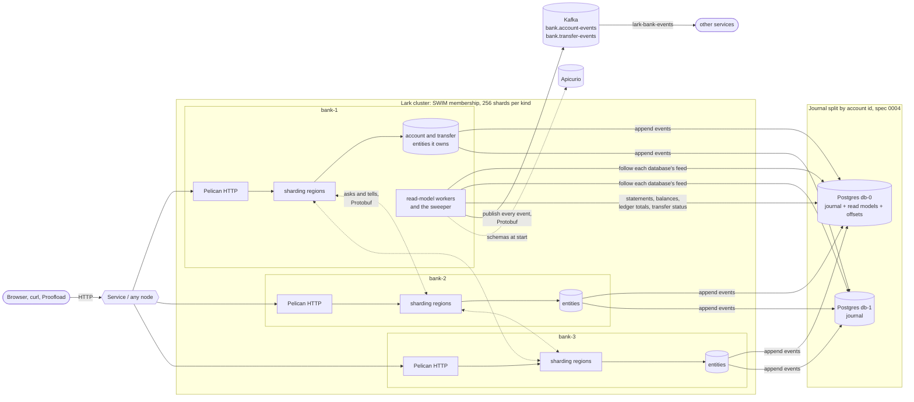
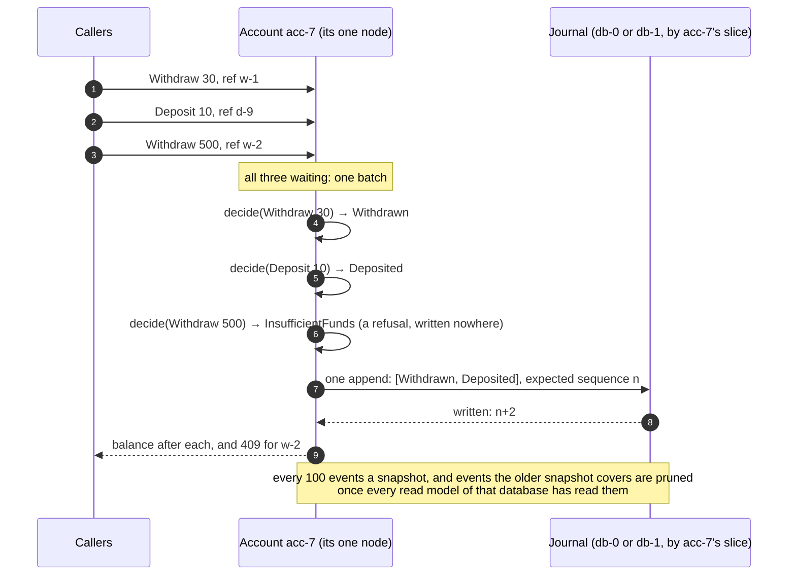
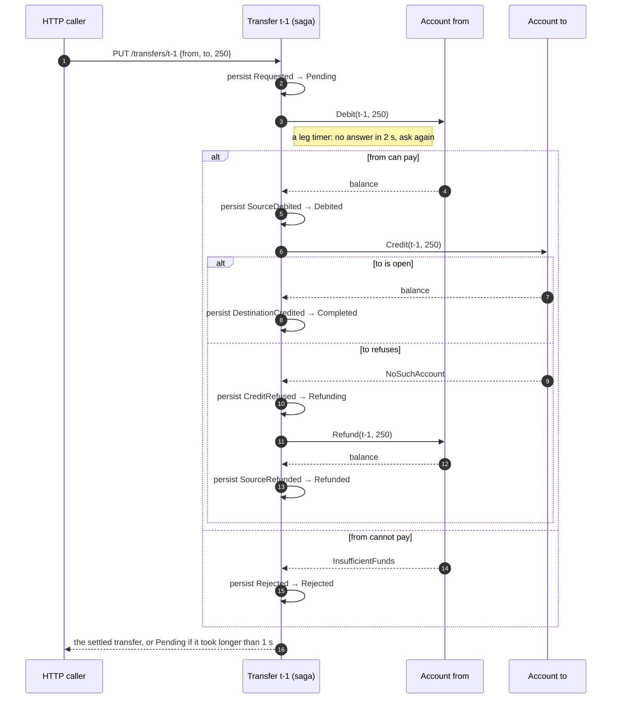
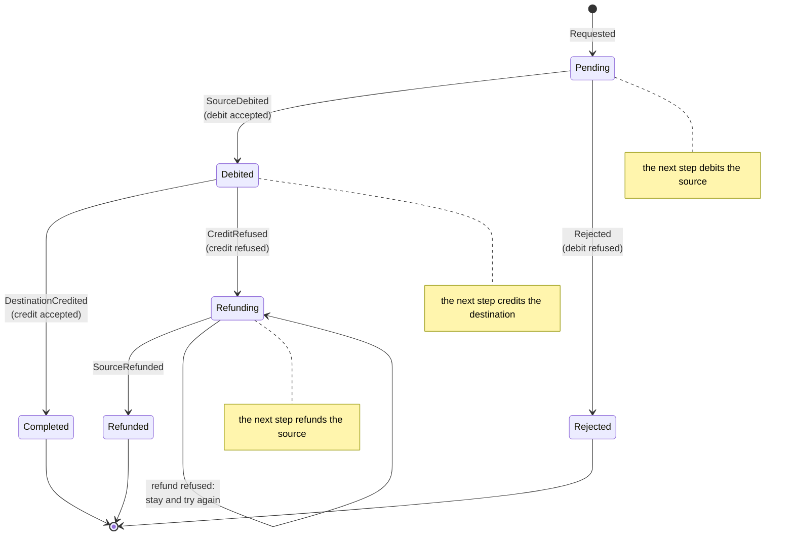
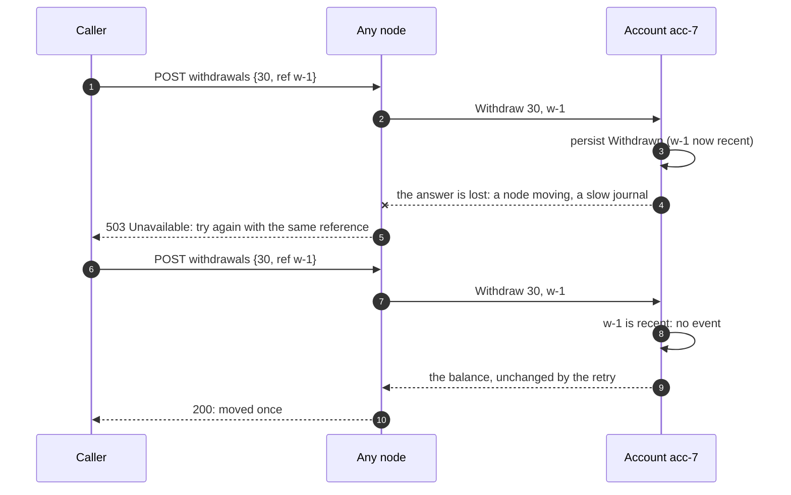
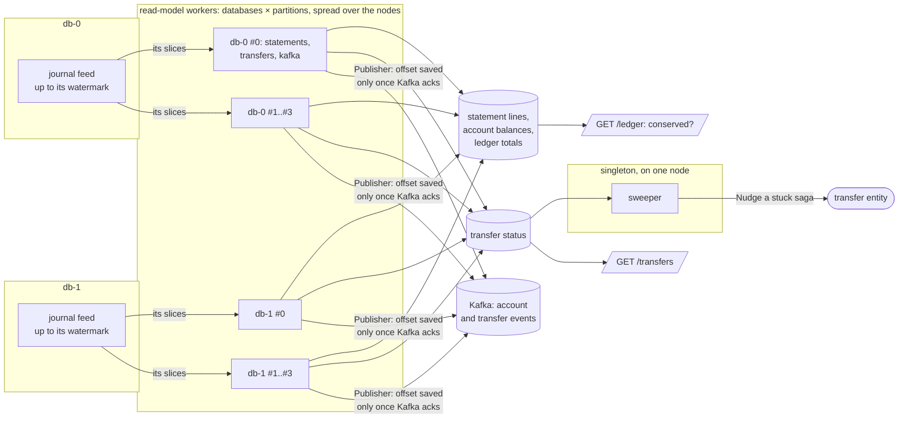
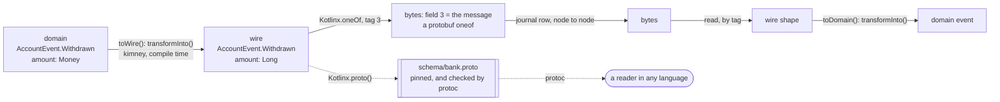

# How the bank works

Seven pictures of Lark Bank. Each shows one idea, and names the spec that decided it.

1. [The whole system](#1-the-whole-system)
2. [One account, one writer](#2-one-account-one-writer)
3. [A transfer, step by step](#3-a-transfer-step-by-step)
4. [The saga's states](#4-the-sagas-states)
5. [A retry that moves money once](#5-a-retry-that-moves-money-once)
6. [The read side: journal to ledger and Kafka](#6-the-read-side-journal-to-ledger-and-kafka)
7. [From a domain event to bytes](#7-from-a-domain-event-to-bytes)

## 1. The whole system

Three nodes form one Lark cluster. Every account and every transfer is an entity that lives on exactly one node,
wherever the cluster placed its shard. Any node takes any HTTP call and forwards it to the owner. Events go to a
journal split across two Postgres databases. The read models, spread over the nodes, also publish every event to
Kafka, for other services to build on (spec 0015); the bank itself reads nothing back.

Membership is SWIM, joined as `bank.cluster` says through lark-app-cluster (lark spec 0096): static seeds in
Docker, or the pods API on Kubernetes, where `CLUSTER_JOIN=kubernetes`. A split is settled by the majority side in
Docker, and by a `Lease` on Kubernetes (spec 0003). A node the others downed ends its process, and is started again.

## 2. One account, one writer

An account is a persistent, sharded entity. Only it changes its balance. It decides each command with the pure
domain and writes the events before it answers. The commands waiting in its mailbox are decided together and
written in one append, up to 64 (lark spec 0086), so a busy account is not held back by a commit per payment.

An account pays out at most its daily limit in a UTC day, withdrawals and transfers' debits together: 10,000 in its
currency, or the limit it was opened with (spec 0027). A refund on the same day gives its debit's share back. A
payout past the limit is refused with the limit and what is left today: a 409 tagged `daily_limit_exceeded` for a
withdrawal, and a transfer `Rejected` with that reason.

## 3. A transfer, step by step

A transfer is a saga: an entity of its own that moves money between two accounts, which may live on two other
nodes. Each step is an event, so a saga recovered on another node carries on from its last event. Each leg is
idempotent by transfer id.

A saga whose node dies mid-transfer starts again elsewhere when it is next asked. If nobody asks, the sweeper
nudges any saga that has not moved for 5 s, found through the transfer-status read model.

## 4. The saga's states

The next step is read off the state, never remembered separately. That is what makes a restart safe.

The ledger checks this at every moment: the sum of balances plus the money in flight equals paid in less paid out.
Money is in flight between `Debited` and `Completed` or `Refunded`.

## 5. A retry that moves money once

A call that times out is `Unavailable`, a 503 that says to try again with the same reference. The account keeps the
last 256 references it applied, so the retry is recognised and answered, not applied again.

Payroll credits take a different path to the same guarantee. They go through a reliable producer, which numbers
each credit per account and resends until it is confirmed. The account keeps the last number it handled from each
producer, in the same append as the events.

## 6. The read side: journal to ledger and Kafka

Each journal database has its own feed, in its own order. Each database's feed is split into partitions by the
ids' slices (spec 0014, lark spec 0106), four by default, and each partition of each read model saves its own offset,
such as `statements@db-1#2`. A worker per database and partition runs its statements, transfer status and Kafka
publishing; the cluster spreads the workers over the nodes as evenly as they go. The projections write in batches,
one transaction and one saved offset per batch, and a replayed batch changes nothing: the ledger's totals count only
the statement lines a batch inserted, whichever partition got there first.

If a worker's node leaves, the cluster starts the worker on another, and each of its projections resumes from its
saved offset. If the sweeper's node leaves, the singleton moves in the same way.

## 7. From a domain event to bytes

The domain knows nothing of serialisation. Wire shapes in `bank.protocol.wire` mirror it case for case. kimney
derives the mapping both ways at compile time, and a Lark `Kotlinx.oneOf` table writes each sealed shape under fixed
tags. `schema/bank.proto` is generated from the wire shapes and pinned (spec 0005).

A field or a case added to the domain and not to its wire shape stops the build at the `transformInto()` that
cannot fill it.

What Kafka carries is not these bytes but a contract of its own (spec 0015): `events/`'s `.proto` files, published as
`lark-bank-events`, mapped from the domain in `protocol`'s `Contract.kt`, and only ever added to. The journal's
encoding can change with the bank; the contract changes only by growing, checked by `buf breaking` in the build and
by Apicurio's `FULL_TRANSITIVE` rule at run time.
