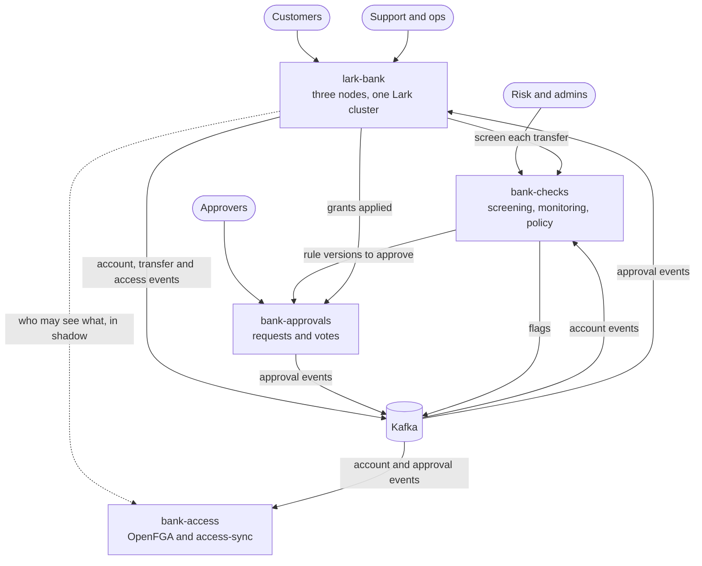
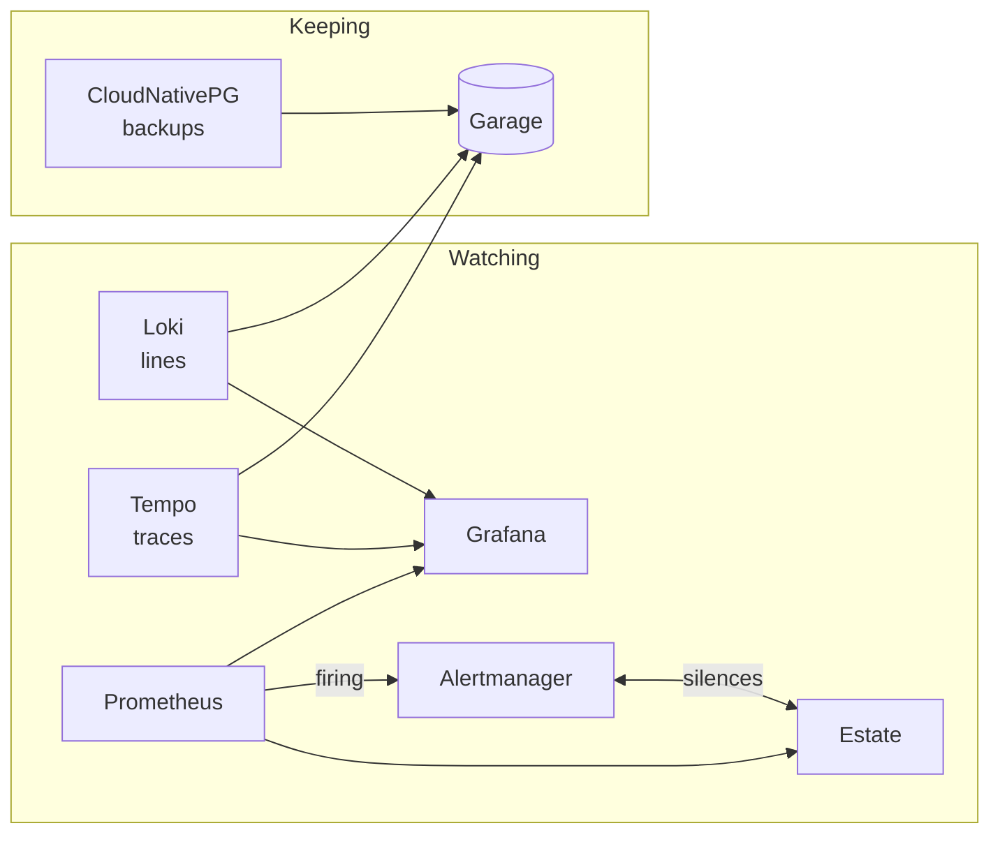

# The services

Lark Bank is four services, a folder each in this repository, sharing Kafka, sign-in and the platform they run on. This page says
what each one is and does now; the specs in `specs/` say why.

## lark-bank

The bank: accounts, money in currencies, and transfers between accounts. This repository.

| | |
|---|---|
| Built with | Kotlin on [Lark](https://github.com/matthewjones372/lark) and [Pelican](https://github.com/matthewjones372/pelican), JDK 25 |
| Runs as | three nodes in one Lark cluster; any node takes any call and forwards it to the entity's node |
| Serves | the API and its docs (`/api-docs`), customer pages (`/`), the ops page (`/ops`), on 8080 |
| Keeps | an event journal split by account across two Postgres databases, and the read models beside the first |
| Publishes | `bank.account-events`, `bank.transfer-events`, `bank.access-events` (staff looks), `bank.access-decisions` |
| Reads | `bank.approval-events`, for support's grants |
| Calls | bank-checks' `POST /screen` before each transfer debits; Approvals to say a grant applied; OpenFGA, in shadow |
| Signs in | customers and staff through OIDC: Pocket ID at home, the test issuer (`issuer/`) elsewhere |

Each account and each transfer is a persistent entity with one writer. A transfer is a saga that debits, credits,
and refunds on a refused credit. `GET /ledger` checks that balances plus money in flight equal what was paid in less
what was paid out. Who may see what is decided by the bank's own rules; bank-access is asked the same questions beside
them and disagreements are counted, until it takes over. [How the bank works](how-the-bank-works.md) draws the inside.

## bank-checks

[bank-checks](../../bank-checks): the checks outside the bank.

| | |
|---|---|
| Built with | Scala 3, ZIO, zio-http; rules in [verdict](https://github.com/matthewjones372/verdict)'s language |
| Serves | `POST /screen` and the admins' rule wizard, on 8090 |
| Keeps | rules and their versions, decisions and flags, in its own Postgres |
| Reads | `bank.account-events` (monitoring), `bank.approval-events` (its own rule changes) |
| Publishes | `checks.flags` |
| Calls | Approvals, for a rule version that would change what is in force |

**Screening** answers each proposed transfer, approved or declined by a rule; the bank approves a transfer itself if no
answer comes within 300 ms. **Monitoring** flags the movements the live rules question. **Policy** holds the rules; a
new version takes force only once Approvals gives it. In compose the bank screens against a stand-in by default; the
real service runs with the `checks` profile.

## bank-approvals

[bank-approvals](../../bank-approvals): changes more than one person
agrees to.

| | |
|---|---|
| Built with | Kotlin on Lark and Pelican |
| Serves | the API and the approvers' pages, on 8070 |
| Keeps | every request as a journal of events in its own hash chain, in its own Postgres |
| Publishes | `bank.approval-events` |

A service asks for one change, shown as the text before and after. The people its policy names approve, reject or
comment, and the service applies the change once enough agree and says so. Requests today: bank-checks' rule versions
and the bank's support grants.

## bank-access

[bank-access](../../bank-access): who may do what, in one place.

| | |
|---|---|
| Built with | [OpenFGA](https://openfga.dev) and its model (`model/`); access-sync and the client in Kotlin |
| Serves | OpenFGA's API, on 8080 |
| Keeps | relationships in OpenFGA's own Postgres |
| access-sync reads | `bank.account-events` (owners), `bank.approval-events` (grants), Pocket ID's groups |
| The client | typed questions, a memo, a 50 ms budget, fails closed, each decision on `bank.access-decisions` |

Every relationship is derived from something already recorded, so an emptied store is rebuilt by reading the topics
from the start. The bank asks it in shadow only; nothing is decided by it yet (spec 0022, `access-flip`).

## Shared

| | |
|---|---|
| Kafka | one broker on compose; each service signs in as its own SCRAM user, allowed only its own topics and groups |
| Apicurio | every topic's Protobuf schema, held to `FULL_TRANSITIVE`; the schemas are `events/`, published as `lark-bank-events` |
| Sign-in | an OIDC provider, the test issuer on compose and kind; its groups (`support`, `risk`, `ops`, `auditor`, `admins`) are what staff may do |
| Logs | one JSON object per line from every service, with `trace_id` where there is one; Fluent Bit on each machine sends them to Loki, which keeps them in Garage for 30 days; the dashboard's Logs row and each alert's `logs` query read them, each `trace_id` a link to its trace |
| Traces | every service exports to Tempo over OTLP; one request is one trace across HTTP, actors and Kafka |
| Metrics | Prometheus, and Grafana's dashboards; what fires goes to Alertmanager, which keeps silences and tells no one yet |
| The estate | [Estate](https://github.com/matthewjones372/estate), two runners: alerts with notes and silences, each service's health, versions, load and lines, and the bank's debug switch, from the catalog in `deploy/k8s/estate/` |
| The cluster | Headlamp, signed in to with `kubectl create token` on kind; what each person may do is Kubernetes RBAC |

## Where it runs

| | Where | How |
|---|---|---|
| Compose | one machine | `deploy/docker/compose.yml`; profiles `checks`, `approvals`, `access`, `traces` add the rest |
| kind | a local Kubernetes | `scripts/up.sh`, from `deploy/k8s` |

On kind the databases are CloudNativePG clusters, backed up to Garage. Running it is in the [runbook](runbook.md); what is built and not yet run, in the order to
run it, is in [bring-up](bring-up.md).
