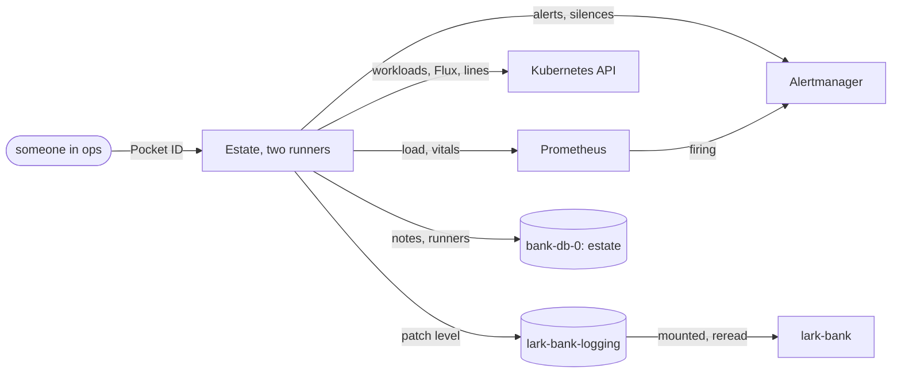

# 0026 — The estate on one page

## Problem

Whether the bank's estate is well, and where to look when it is not, is spread over Prometheus, Grafana, Headlamp,
Flux and GitHub, and turning on debug logging takes a release. A developer joins them in their head every morning and
at every alert.

Estate (its own repository, `estate`) is a service that answers it for any estate: alerts with their notes and
silences, each service's health, versions through the pipeline in every environment, load, the services' own lines,
and a debug switch that turns itself off. This spec is the bank adopting it.

## Not doing

- **Building Estate here.** It is generic, and built in its own repository; nothing in it knows about the bank.
- **Paging.** Alertmanager is added for silences; who it pages is a later spec.
- **Compose.** There is no Kubernetes or Flux there to read.
- **The checks' debug switch.** bank-checks' zio-logging fixes its level at start; until it rereads it, the checks
  have no switch on the page.

## Shape

**The bank's catalog**, `deploy/k8s/estate/catalog.yaml`, beside the deploy files it names, in Estate's catalog
format and checked by Estate's own `check`, run from Estate's image by `scripts/estate-check.sh`, which `scripts/up.sh`
runs first:

- Environments: `home` (the three machines) and `kind`, each with its own Prometheus, Alertmanager, cluster and Flux,
  and its Grafana's address as a value its links name. Each Estate shows its own: home's settings choose `home`, kind's
  `kind` (Estate's spec 0035), so the catalog is one file for both.
- Services: lark-bank, bank-checks, bank-approvals and bank-access (its OpenFGA and access-sync), each with its
  workloads, its build, the `apps` Kustomization and its image policy, its load queries, its runbook section, links
  to Grafana, and, where the service rereads its level, the logging ConfigMap its debug switch patches.
- Stores: both journal databases, by CloudNativePG's metrics.
- Vitals: transfers per second, how far the ledger is out at rest, requests across the estate, the slowest p99.
- The map: the bank, the checks, Approvals, bank-access, Kafka, both journal databases and Pocket ID, with screening,
  access and journal edges as rates.

**Estate deployed**, `deploy/k8s/estate/`: Estate's `deploy/` and `deploy/cluster/` copied in, so every file the bank
runs is in this repository. Two runners of one Estate cluster; its settings and the catalog in the `estate`
ConfigMap; its notes, and where the runners find each other, in a database `estate` on `bank-db-0` owned by its own
login; its service account reading the cluster, pods' logs included, as Estate's `estate-reader` grants, and patching
only the logging ConfigMaps named in the catalog.

- On kind it signs in through the test issuer, at `http://localhost:8060` through a port-forward.
- At home (the overlay) it is at `https://estate.example.internal` behind Traefik with the home CA, signed in with Pocket ID
  as the confidential client `estate`, whose secret `pocket-id-setup` makes and keeps in `estate-oidc-credentials`.
  Its session key, its database password and a GitHub token come from SOPS. Only Traefik reaches its pages,
  Prometheus its metrics, and its runners each other.
- Roles: `viewer` for `ops`, `support`, `risk`, `auditor` and `admins`; `operator` for `ops` and `admins`.

**Alertmanager**, one pod with its silences on a small volume, Prometheus sending to it, so silences have somewhere to
live. It tells no one yet.

**Debug in the bank's services**: lark-bank, bank-approvals and access-sync each read their log level from a
`<name>-logging` ConfigMap, `level: INFO`, mounted as a file named by `LOG_LEVEL_FILE` and reread every ten seconds;
the root and Lark's loggers take the level, the libraries' quietened loggers keep theirs. Flux makes each ConfigMap
once and leaves it (`kustomize.toolkit.fluxcd.io/ssa: IfNotPresent`), so a reconcile never undoes a switch.



## Why this shape

The bank gets the page without owning a tool: its catalog and its copy of Estate's manifests are all it keeps, as
with Headlamp. The catalog lives beside the deploy files it names, so a service added to the estate and to the page is
one commit. Estate's manifests are copied rather than named as a remote base, because Flux builds kustomizations
without reaching other repositories, and an upgrade of Estate's manifests is then a reviewed diff here. The level is
read from a mounted file rather than the Kubernetes API, so the services need no RBAC of their own for it; the cost is
the kubelet's delay in updating the file, up to a minute.

## Depends on

- **Estate's spec 0035**, for a catalog with two environments where each Estate reaches one.
- **Spec 0025** for Pocket ID's sign-in at home.
- **bank-approvals and bank-access** reading their level as the bank does, each in its own repository.

## Stack

- [x] **`estate-catalog`** — `deploy/k8s/estate/catalog.yaml`, checked by Estate's `check` before `scripts/up.sh`
      applies anything.
      Done when: Estate started with it on kind lists the four services, with every link opening the right place.
- [x] **`estate-deploy`** — Estate's manifests, its database and login, the RBAC, the home overlay's ingress, Pocket
      ID client, CA, NetworkPolicies and SOPS entries.
      Done when: on kind, someone in `ops` signs in through the test issuer and sees the estate, and someone in no
      group sees the no-access page.
- [x] **`alertmanager`** — Alertmanager, Prometheus sending to it.
      Done when: an alert silenced on Estate's page is silenced in Alertmanager, with its reason.
- [ ] **`logging-configmaps`** — the bank's level from `lark-bank-logging`, its ConfigMap in the deploy files, and its
      debug switch in the catalog.
      Done when: debug turned on for the bank from Estate shows its DEBUG lines within two minutes, and they stop on
      their own when the time is up.
- [ ] **`logging-approvals-sync`** — bank-approvals and access-sync reading theirs the same way, each in its own
      repository; their ConfigMaps here, and their switches in the catalog and Estate's RBAC.
      Done when: the same, for each.

## Acceptance

```bash
scripts/up.sh && kubectl -n lark-bank port-forward svc/estate 8060:80   # signed in through the test issuer
kubectl kustomize deploy/overlays/home >/dev/null                          # home renders
```

## Open questions

None.
